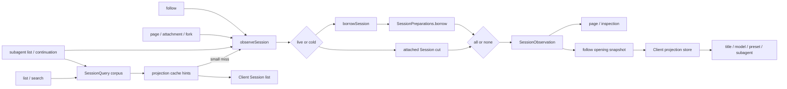

# Agent Note: Session observations and projection-owned client state

Status: implemented

English | [中文](2026-08-25-session-observations-and-projection-owned-client-state.zh.md)

## Problem

Session-facing consumers needed the same logical data but resolved it independently. List, follow, page, attachment and fork reads, and subagent inspection each chose between an attached Session, persisted metadata, a prepared Session, and projection cache entries. One page visit could therefore materialize the same cold log more than once, and independently assembled header, event, cursor, and projection values could describe different cuts.

Client features also kept Session-derived facts in several forms. Title had dedicated list and update handling; model selection mixed a Session-specific catalog request with local state; agent preset display could infer a global default before the current Session arrived; and subagent listing scanned or reconstructed identity separately. These mirrors introduced intermediate states in which the UI showed a guessed default, a raw id, or an unavailable state even though the durable Session already determined the answer.

Unifying only the persistence read would leave those Client mirrors as competing authorities. Unifying only the Client fields would leave each Host endpoint free to obtain a different source cut. The read unit and the derived-state unit therefore need one coordinated ownership rule.

## Decision

Exact Session reads use a retained `SessionObservation`, and replayable Session-derived values exposed to the Client use registered projections. Observation owns source selection and one immutable read cut; projection owns derivation from that cut. API layers select what to publish, while Client code consumes finished values and does not reconstruct Session facts from events or duplicate them in domain-specific mirrors.

### Data flow

The two ownership rules meet at the observation's projection snapshot. Lightweight listing may stop at cached hints; every exact opening reaches the same observation path and gives the Client a complete replacement baseline.

### Observation is the point-read unit

`SessionQueryEngine.observeSession(sessionId, options)` returns a disposable `SessionObservation` containing one source kind, header, contiguous event prefix, cursor, optional projection snapshot, and the durable revision for a prepared source. An attached Session wins. Otherwise `SessionPersistence.borrowSession()` and `SessionPreparations.borrow()` share and pin one prepared Session, including an in-flight cold load.

Every owner disposes its observation. `retain()` creates another lease over the same cut, which lets `session.follow` publish a snapshot and then transfer that exact prepared source to background Agent promotion without rereading the log. A live Session that appears during cold resolution wins before publication; a disappeared live source is retried as cold.

### Source resolution and lifetime

An observation binds all returned fields to one lifecycle witness. Callers do not combine a header from corpus listing, events from persistence, and projections from a later live Session. The selected header and event prefix produce the cursor and projection snapshot together.

Live preference is checked both before and after a cold borrow. The second check closes the race in which an Agent attaches while persistence is loading. If persistence itself reports that a live source won but that source has already detached by the time SessionQuery examines it, resolution restarts instead of publishing an unowned reference.

Persistence absence maps to Session-not-found only after no attached Session exists. Durable corruption, source-identity conflict, cancellation, and operational persistence failure remain distinct `SessionQueryError` outcomes so API owners can preserve their own public error vocabulary without duplicating source detection.

The observation owns no mutation authority. Its event array is an immutable prefix, and its prepared Session remains unpublished. Promotion is an explicit ownership transfer performed by the Session Controller after it has emitted the opening snapshot; other readers cannot turn an observation into a live Agent.

Projection work is deliberately `all | none`. `all` computes every registered projection at the observation's event cursor; `none` leaves projection state untouched. There is no per-key preparation state, `projectionKeys` mode, or cached `viewedState`/`viewedValue` layer. A publisher may filter the completed values for an audience, but the underlying observation is never partly projected.

### Projection execution boundary

For a live source, `all` reads one synchronous registry snapshot. For a prepared source, the projection cache may seed valid state rows, after which every registered unit advances over the exact remaining event prefix. The resulting client values share one `asOfSeq`.

Filtering belongs after computation because it changes disclosure, not state. A page authorization check may consume only `subagent`, and a list row may publish only list-relevant values, while both still rely on a complete projected cut when they request projection work.

The registry owns fold state; each domain owns its `init`, `apply`, `view`, schemas, and `stateVersion`. SessionQuery knows only whether projection work is required. It does not know title, model, preset, subagent, token, image, plan, todo, or goal semantics.

`view` remains an uncached synchronous conversion over folded state. Its cost is bounded by the registered projection units and is paid at snapshot publication; introducing a second cache would add invalidation states without reducing event replay.

Corpus listing remains a separate lightweight operation. `listSessions()` returns live-preferred headers without materializing every log. Session list and subagent list first use live projection state or durable projection-cache rows. Session list may take one complete observation for an individually stored artifact within its configured small-log limit when cached metadata cannot establish whether it is blank; a large or unreadable cache miss remains visible with unknown hints.

`session.follow` publishes a required opening snapshot containing header, cursor, the initial event window, and a complete projection baseline. Reconnect replaces the previous generation from another complete snapshot. `session.page` is reserved for older-history reads and gap repair. Observation-only reads never activate an Agent; only an ordinary follow may retain its prepared observation and request promotion after the opening snapshot has been delivered.

### Read audiences

Each public operation chooses one query and projection policy. The choice is part of that operation's behavior rather than a heuristic inside persistence or transport.

| Operation | Read path | Projection policy | Agent activation |
|---|---|---|---|
| `session.list` | Corpus headers, live state, and cached rows; bounded small-log fallback | Partial hints, or one full small-log observation | Never |
| `session.search` | Corpus authorization plus the configured search provider | None for result listing | Never |
| `session.follow` | One exact observation | All, carried in the opening snapshot | Ordinary cold Session only, after snapshot delivery |
| `session.page` | One exact observation | None, except projection-backed subagent authorization | Never |
| Attachment and fork source | One exact observation | None unless authorization requires it | Never for the source |
| Subagent list and continuation | Corpus plus live/cache/observation resolution | All on a cold fallback; audience consumes identity or inherited values | Never for listing; continuation follows its explicit command semantics |

### Replayable Client facts are projection-owned

A Client-visible fact belongs to `SessionProjectionMap` when its value is determined by the Session header or event log and must survive reload, cold access, or reconnect. The rule covers title, list metadata, model selection, agent preset selection, subagent identity, and subagent timing. Their domain packages own pure projection definitions; the Session transport and Client value store remain domain-neutral.

The three projection delivery states have different meanings:

- A Session-list hint is optional, partial, and possibly stale. A missing key means unknown, so a list consumer must not invent an empty value or deployment default.
- A follow opening baseline is the complete set of client-visible projection capabilities registered at its cursor. A missing key there means the capability is absent for that Host composition.
- An explicit `null` is a domain-computed no-value result. It is distinct from a missing list hint and survives JSON transport.

These distinctions prevent one overloaded `undefined` from representing cache miss, unloaded plugin, and a real domain answer. API types name list data as hints and opening data as a baseline so a consumer cannot assume equivalent completeness merely because both carry projection values.

### Client merge rules

| Input | Completeness | Freshness | Meaning of missing key |
|---|---|---|---|
| Session list hints | Partial | Last durable checkpoint or bounded fallback cut | Unknown |
| Follow opening baseline | Complete for the Host composition | Exact opening cursor | Capability absent |
| Projection frame | One whole key | Event sequence carried by the frame | Not applicable |

The Client stores one row per key with its sequence number. A newer hint, baseline, or frame replaces a row; an equal or older input is ignored. Reconnect can therefore replace the event window without rolling back a projection frame that was already accepted at a later sequence.

The list view reads the same per-Session store as the opened Session. Hints can populate title, preset, and other list presentation before follow completes; the opening baseline then converges that state without creating a second summary-only authority.

The per-Session Client projection store accepts list hints, the follow baseline, and later whole-value frames under one higher-sequence-wins rule. It never folds Session events. A baseline or frame may advance a hinted value, while an older cut cannot overwrite a newer row.

Data that is not derived from one Session remains outside projections. `session/modelCatalog` owns the Host-generation model catalog, and `agentPresets/list` owns the configurable preset roster. A selector combines the relevant catalog with the Session's `modelSelection` or `agentPreset` projection only when both inputs are ready. During refresh it may retain the last complete catalog; before the first complete pair it reports loading instead of rendering a guessed name or availability verdict.

Client-local interaction state also remains local: loading and error status, an open menu, an in-flight selection, and a staged choice for a not-yet-created Session are not replayable Session facts. Once a choice applies to a Session, its durable event and projection become authoritative.

### Domain applications

- **Title and list metadata.** Cached projection hints may render an existing title and determine blankness or recency. Missing hints leave those facts unknown; only the bounded small-log policy may resolve them during listing.
- **Model selection.** `model/selection` records a complete provider, model, and optional reasoning effort. `modelSelection` distinguishes the last request's route from a later selection pending consumption by a request header.
- **Agent preset.** The projection initializes from immutable Session metadata and advances on preset-selection events. A missing or `null` value is not replaced with the deployment default for an existing Session.
- **Subagent identity.** The `subagent` unit remains the sole descriptor interpreter. Listing obtains candidates from the shared corpus and resolves values through live state, projection cache, or an observation rather than scanning events itself.
- **Subagent presentation.** Opening projection values establish timing and identity before the Client declares the child interactive or offline, so transport loading does not masquerade as a durable state.

These migrations remove special-case Client state without making projection own provider catalogs or interaction mechanics. A domain still owns mutations and commands; projection owns only their replayable Session result.

### Failure and readiness boundaries

- A list cache miss is not an error and does not hide the row. Unknown hints remain absent until a bounded fallback or exact opening supplies them.
- A projection failure during an exact cold observation makes that observation fail as corrupt Session data; callers do not publish a mixture of successful keys and failed keys.
- A subagent candidate's failed cold observation is isolated to that candidate's diagnostic row; sibling candidates remain usable.
- A catalog load failure is Client-visible catalog state. It does not erase a previously complete catalog during refresh and does not synthesize a Session selection.
- A follow carrier generation is not accepted until its opening snapshot is validated and applied. The previous generation remains visible during reconnect.

Cancellation stops queued or in-flight cold resolution at documented checkpoints and releases every acquired lease. Cancellation does not convert into not-found, nor may it leave a prepared entry pinned.

### Ownership matrix

| Concern | Owner | Non-owner |
|---|---|---|
| Cold materialization and revision checks | Session persistence | API Controller and Client |
| Exact live-preferred read cut | SessionQuery observation | Individual endpoint helpers |
| Fold state and client-value computation | Projection registry and domain unit | SessionQuery and Client |
| Partial list acceleration | Projection cache and list policy | Follow protocol |
| Opening and reconnect replacement | Session follow and journal stream | Session page |
| Per-key value ordering | Client projection store | Domain UI components |
| Provider or preset catalog lifecycle | Its catalog directory | Session projection |
| Rendering and transient interaction state | Domain UI package | Host projection units |

### Extension rules

1. Determine whether a new value is a replayable fact of one Session. If it is, define or reuse its durable header/event input before adding a Client field.
2. Register one pure projection unit in the owning domain. Keep fold state and Client view types distinct when their representations differ.
3. Let exact readers request `projectionMode: 'all'`; filter only when constructing an audience-specific response.
4. Let list consumers accept an optional hint. Do not force full corpus hydration merely to avoid an explicit unknown state.
5. Feed the generic Client projection store. Do not add a dedicated reconnect fetch, event reducer, or Session summary mirror for the same fact.
6. Keep non-Session catalogs and ephemeral UI state in their own owners, and define readiness before combining them with a projection value.

These rules apply to new Session-derived Client state even when a direct event scan appears cheap. Complexity is measured across cold reads, reconnect, multiple tabs, plugin lifetime, and future consumers rather than at the first call site.

### Relationship to existing decisions

- [Reusable Session preparation](2026-08-05-session-preparation.md) owns cold materialization, repair, reservation, and publication. Observation adds a shared read lease over that prepared object; it does not move preparation into SessionQuery.
- [Session history and Remote event transport](2026-08-18-session-history-and-event-transport.md) owns stream generations and replacement semantics. This decision supplies the exact snapshot that opens each journal generation.
- [Projection state and Client views](2026-08-19-session-projection-state-and-client-views.md) owns the distinction between Host fold state and Client values. This decision governs where those values are consumed and how partial list hints differ from a complete baseline.
- [Subagent identity projection](2026-08-06-subagent-list-identity-projection.md) continues to own descriptor folding, the serializable `null` sentinel, and the own-suffix sequence check. This decision supersedes only its independent corpus merge and direct cold-inspection path: listing now uses SessionQuery's corpus and observation.
- The broader [session projection and command-log proposal](../../proposed/architecture/2026-07-27-session-projection-and-command-log.md) remains proposed for the portions not represented by shipped code. This decision records the shipped observation and Client-ownership subset.

## Verification

Persistence and SessionQuery tests pin shared cold loading, cancellation, live-source races, retained observations, disposal, and all-or-none projection calculation. Session Controller and Gateway tests pin snapshot-first opening, replacement reconnect, older-page reads, gap repair, list-cache hints, bounded small-log fallback, and promotion after snapshot delivery.

Client tests pin higher-sequence-wins projection storage, title updates, model catalog and selection readiness, preset roster refresh and Session-specific selection, and subagent loading without transient offline presentation. Subagent tests pin corpus enumeration, cache and observation fallback, lifecycle witnesses, bounded cold reads, and no Agent activation during listing.

## Alternatives considered

**Keep source resolution in each consumer.** Rejected because every caller would continue to implement its own live race, persistence error mapping, preparation lifetime, cancellation, and projection cut, allowing both duplicate work and inconsistent results.

**Activate an Agent for every exact read.** Rejected because list, history, attachment, search, and subagent inspection are read operations. Activation loads plugins and changes process state, and it has no natural retirement point for pagination or catalog reads.

**Prepare only requested projection keys.** Rejected because a partially projected Session creates another lifecycle state that every cache, restore, plugin-registration, and caller path must track. Projection units are pure and few; computing all registered units for an exact observation is simpler than maintaining `O(E*k)` partial state instead of `O(E*P)` complete state.

**Cache each projection's viewed value separately.** Rejected because `view` is a pure synchronous conversion over already folded state. A second `viewReady`/`viewedState`/`viewedValue` cache adds invalidation and plugin-lifetime states without avoiding event folding.

**Keep dedicated summary fields, RPCs, or Client reducers.** Rejected because each creates a second authority beside the event log and projection registry. It also requires separate baseline, reconnect, and race handling for every domain value.

**Require complete projections on every list row.** Rejected because listing a large cold corpus would force full-log work before navigation can render. Partial cache hints preserve a cheap list path; consumers already have an explicit unknown state until opening supplies the exact baseline.

**Render guessed defaults while catalog or projection input is missing.** Rejected because the guess can visibly disagree with the Session and then change after loading. Initial uncertainty renders as loading; refresh retains the last complete value until the replacement is ready.

## Consequences

Session consumers share one live-preferred read model and one prepared cold object. Header, events, cursor, and projections belong to the same observation, and ordinary page opening can reuse that object for later promotion. New point-read consumers use SessionQuery instead of composing persistence and registry calls themselves.

Session-derived Client state has one extension path: record or identify the durable input, register a pure projection unit, and consume its finished value through the generic store. Domain-specific catalogs may remain separate when they are not Session-derived, but they cannot substitute a default for an unknown Session projection.

The simpler state model accepts bounded extra computation. An exact projected cold observation evaluates every registered unit, and a small cache-missing list artifact may be read in full. Large list rows can remain partially described until opened, so every list consumer must preserve the distinction among unknown, absent capability, and explicit no value. Observation leases also make disposal part of the caller contract; retaining a prepared source without releasing it prevents normal cache retirement.
