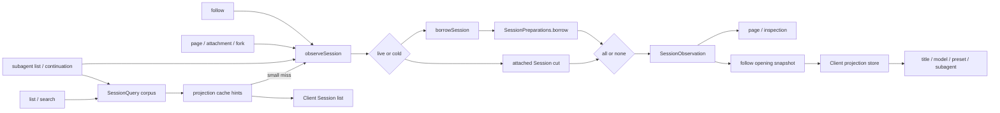

# Agent Note: Session observation 与 projection 所有的客户端状态

Status: implemented

[English](2026-08-25-session-observations-and-projection-owned-client-state.md) | 中文

## 问题

面向 Session 的多个消费方需要相同的逻辑数据，却各自完成解析。list、follow、page、附件／fork 读取和 subagent 检查分别在已挂载 Session、持久化元数据、prepared Session 与 projection cache 之间作选择。因此一次页面访问可能多次物化同一份冷日志，各自拼装的 header、事件、cursor 和 projection 值也可能来自不同的读取切面。

客户端功能还以多种形式保存 Session 派生事实。title 有专门的 list 和更新逻辑；模型选择把 Session 专用 catalog 请求与本地状态混在一起；agent preset 展示可能在当前 Session 到达前猜测全局默认值；subagent list 则单独扫描或重建 identity。这些镜像产生了中间状态：即使持久化 Session 已经决定答案，UI 仍会短暂显示猜测出的默认值、原始 id 或不可用状态。

仅统一持久化读取，Client 镜像仍会成为互相竞争的真源。仅统一 Client 字段，各 Host 入口仍可能获得不同的数据切面。因此读取单元与派生状态单元需要一条配套的 ownership 规则。

## 决策

Session 精确读取使用可保留的 `SessionObservation`，向 Client 暴露的可回放 Session 派生值使用已注册 projection。Observation 负责选择数据源和提供一份不可变读取切面；projection 负责从该切面派生状态。API 层只选择要发布的内容，Client 只消费成品值，不从事件重建 Session 事实，也不在各领域镜像中重复保存这些事实。

### 数据动线

两条 ownership 规则在 observation 的 projection snapshot 处汇合。轻量 list 可以止于 cache hints；每次精确 opening 都进入同一 observation 路径，并向 Client 提供完整 replacement baseline。

### Observation 是 point read 单元

`SessionQueryEngine.observeSession(sessionId, options)` 返回可 dispose（资源释放）的 `SessionObservation`，其中包含同一份 source kind、header、连续事件前缀、cursor、可选 projection snapshot，以及 prepared source 的持久化 revision。已挂载 Session 优先；否则 `SessionPersistence.borrowSession()` 与 `SessionPreparations.borrow()` 共享并固定一份 prepared Session，包括尚未完成的冷加载。

每个 owner 都会 dispose 自己的 observation。`retain()` 为同一切面创建另一份 lease，使 `session.follow` 能够先发布 snapshot，再把完全相同的 prepared source 转交给后台 Agent promotion，而无需重读日志。冷解析期间出现的 live Session 会在发布前胜出；已经消失的 live source 会按 cold source 重试。

### 数据源解析与生命周期

一份 observation 把所有返回字段绑定到同一 lifecycle witness。调用方不会把 corpus list 的 header、persistence 的 events 和稍后 live Session 的 projections 拼在一起。选中的 header 与事件前缀共同产生 cursor 和 projection snapshot。

系统在 cold borrow 前后都检查 live 优先级。第二次检查封住 persistence 加载期间 Agent 完成 attach 的竞态。如果 persistence 报告由 live source 胜出，但 SessionQuery 检查时该 source 已经 detach，解析会重新开始，而不是发布一份无人持有的引用。

只有在不存在已挂载 Session 后，persistence absence 才映射为 Session-not-found。持久数据损坏、source identity 冲突、取消和 persistence 操作失败分别保留不同的 `SessionQueryError`，API owner 因而可以维持自身公开错误词汇，而不用重复数据源判定。

Observation 不拥有任何 mutation 权限。其事件数组是不可变前缀，prepared Session 保持未发布。Promotion 是 Session Controller 在 opening snapshot 发出后执行的显式 ownership transfer；其他读方不能把 observation 变成 live Agent。

Projection 工作明确只有 `all | none` 两种模式。`all` 在 observation 的事件 cursor 上计算所有已注册 projection；`none` 完全不触碰 projection 状态。系统不存在按 key preparation 的状态、`projectionKeys` 模式或额外的 `viewedState`／`viewedValue` cache。发布方可以按 audience 筛选已完成的值，但底层 observation 不会处于只算完部分 projection 的状态。

### Projection 执行边界

对于 live source，`all` 读取一份同步 registry snapshot。对于 prepared source，projection cache 可以播种有效 state row，随后每个已注册 unit 在精确的剩余事件前缀上推进。得到的 Client value 共用一个 `asOfSeq`。

筛选发生在计算完成之后，因为它改变的是披露内容，而不是状态。Page 鉴权可以只消费 `subagent`，list row 可以只发布 list 相关值；只要它们请求 projection 工作，仍然依赖一份完整 projected cut。

Registry 拥有 fold state；各领域拥有自己的 `init`、`apply`、`view`、schema 和 `stateVersion`。SessionQuery 只知道是否需要 projection 工作，不理解 title、model、preset、subagent、token、image、plan、todo 或 goal 的语义。

`view` 保持为 folded state 上无 cache 的同步转换。其成本由已注册 projection unit 数量界定，并在 snapshot 发布时支付；引入第二层 cache 只会增加 invalidation 状态，无法减少 event replay。

语料库 list 仍是独立的轻量操作。`listSessions()` 返回 live-preferred header，而不物化每份日志。Session list 与 subagent list 先读取 live projection 状态或持久 projection-cache row。当 cache 无法判断 Session 是否为空，且该 Session 拥有的独立产物未超过配置的小日志限制时，Session list 可以执行一次完整 observation；大型或不可读的 cache miss 仍以 hints 未知但 row 可见的方式返回。

`session.follow` 发布必需的 opening snapshot，其中包含 header、cursor、首个事件窗口和完整 projection baseline。重连使用另一份完整 snapshot 替换上一 generation。`session.page` 仅用于旧历史读取与 gap repair。只读 observation 不激活 Agent；只有普通 follow 可以保留 prepared observation，并在 opening snapshot 已交付后请求 promotion。

### 读取 audience

每个公开操作选择一组查询与 projection 策略。该选择属于操作本身的行为，而不是 persistence 或 transport 内部的启发式判断。

| 操作 | 读取路径 | Projection 策略 | Agent 激活 |
|---|---|---|---|
| `session.list` | Corpus header、live state 和 cached row；有界小日志 fallback | 部分 hints，或一次完整小日志 observation | 从不 |
| `session.search` | Corpus 鉴权加已配置 search provider | 结果列表不计算 | 从不 |
| `session.follow` | 一份精确 observation | 全算，并由 opening snapshot 携带 | 仅普通 cold Session，且在 snapshot 交付后 |
| `session.page` | 一份精确 observation | 不计算，但 projection-backed subagent 鉴权除外 | 从不 |
| Attachment 与 fork source | 一份精确 observation | 鉴权不要求时不计算 | source 从不激活 |
| Subagent list 与 continuation | Corpus 加 live/cache/observation 解析 | cold fallback 全算；audience 只消费 identity 或继承值 | Listing 从不；continuation 遵循显式命令语义 |

### 可回放的 Client 事实归 projection 所有

当一个 Client 可见值由 Session header 或事件日志决定，并且必须在刷新、冷访问或重连后恢复时，它属于 `SessionProjectionMap`。这条规则覆盖 title、list metadata、model selection、agent preset selection、subagent identity 和 subagent timing。各领域包拥有纯 projection definition；Session transport 与 Client value store 不理解具体领域。

Projection 的三种交付状态含义不同：

- Session-list hint 是可选、部分且可能陈旧的数据。key 缺失表示未知，因此 list 消费方不得自行补成空值或部署默认值。
- Follow opening baseline 是其 cursor 上所有已注册 Client 可见 projection capability 的完整集合。此处缺少 key 表示当前 Host composition 不具备该 capability。
- 显式 `null` 是领域计算出的无值结果。它不同于 list hint 缺失，并且能够完整通过 JSON transport。

这些区别避免由一个重载的 `undefined` 同时表示 cache miss、plugin 未加载和真实领域答案。API 类型把 list 数据命名为 hints，把 opening 数据命名为 baseline，因此消费方不能只因两者都携带 projection value 就假定其完整性相同。

### Client 合并规则

| 输入 | 完整性 | 新鲜度 | key 缺失的含义 |
|---|---|---|---|
| Session list hints | 部分 | 上次持久 checkpoint 或有界 fallback cut | 未知 |
| Follow opening baseline | 对当前 Host composition 完整 | 精确 opening cursor | Capability 不存在 |
| Projection frame | 单个完整 key | Frame 携带的 event sequence | 不适用 |

Client 为每个 key 保存带 sequence number 的一行。更新的 hint、baseline 或 frame 会替换 row；相同或更旧的输入被忽略。因此 reconnect 可以替换 event window，而不会回退已经在更晚 sequence 接受的 projection frame。

List view 与已打开 Session 读取同一个 per-Session store。Hints 可以在 follow 完成前填充 title、preset 和其他 list presentation；opening baseline 随后收敛这份状态，而不会建立第二套 summary-only authority。

每个 Session 的 Client projection store 按一条 higher-sequence-wins 规则接收 list hints、follow baseline 和后续 whole-value frame。它从不折叠 Session event。Baseline 或 frame 可以推进 hinted value，较旧切面不能覆盖较新的 row。

不由单个 Session 派生的数据不进入 projection。`session/modelCatalog` 持有当前 Host generation 的 model catalog，`agentPresets/list` 持有可配置 preset roster。Selector 只在相应 catalog 与 Session 的 `modelSelection` 或 `agentPreset` projection 均就绪后组合两者。刷新时可以保留上一份完整 catalog；第一次获得完整输入前显示 loading，而不是展示猜测的名称或可用性结论。

Client 本地交互状态也继续留在本地：loading 和 error 状态、打开的菜单、进行中的选择，以及为尚未创建 Session 暂存的选择都不是可回放 Session 事实。选择一旦应用到 Session，其持久事件与 projection 就成为权威。

### 领域应用

- **Title 与 list metadata。** Cached projection hints 可以渲染已有 title，并判断 blankness 或 recency。Hints 缺失时这些事实保持未知；listing 期间只有有界小日志策略可以解析它们。
- **Model selection。** `model/selection` 记录完整 provider、model 和可选 reasoning effort。`modelSelection` 区分上一请求使用的 route，以及等待 request header 消费的较晚 selection。
- **Agent preset。** Projection 从不可变 Session metadata 初始化，并随 preset-selection event 推进。对于现有 Session，缺失或 `null` 值不会替换成部署默认值。
- **Subagent identity。** `subagent` unit 仍是唯一 descriptor interpreter。Listing 从共享 corpus 获得 candidate，并通过 live state、projection cache 或 observation 解析值，不自行扫描 event。
- **Subagent presentation。** Opening projection value 在 Client 宣布 child 可交互或离线前建立 timing 与 identity，因此 transport loading 不会伪装成 durable state。

这些迁移删除特殊 Client state，但不会让 projection 接管 provider catalog 或交互机制。领域仍拥有 mutation 和 command；projection 只拥有其可回放 Session 结果。

### 失败与 readiness 边界

- List cache miss 不是错误，也不会隐藏 row。未知 hints 保持缺失，直到有界 fallback 或精确 opening 提供值。
- 精确 cold observation 中的 projection failure 使整份 observation 按损坏的 Session data 失败；调用方不会发布成功 key 与失败 key 的混合结果。
- 一个 subagent candidate 的 cold observation 失败只影响该 candidate 的 diagnostic row；sibling candidate 继续可用。
- Catalog load failure 是 Client 可见的 catalog state。它不会在 refresh 期间清除上一份完整 catalog，也不会合成 Session selection。
- Follow carrier generation 只有在 opening snapshot 完成校验与应用后才被接受。Reconnect 期间继续显示上一 generation。

取消会在文档规定的检查点终止排队中或进行中的 cold resolution，并释放每一份已获得 lease。取消不会变成 not-found，也不能让 prepared entry 保持 pinned。

### Ownership 矩阵

| 事项 | Owner | 非 owner |
|---|---|---|
| Cold materialization 与 revision 检查 | Session persistence | API Controller 与 Client |
| 精确 live-preferred read cut | SessionQuery observation | 各 endpoint helper |
| Fold state 与 Client-value 计算 | Projection registry 与 domain unit | SessionQuery 与 Client |
| 部分 list acceleration | Projection cache 与 list policy | Follow protocol |
| Opening 与 reconnect replacement | Session follow 与 journal stream | Session page |
| Per-key value ordering | Client projection store | Domain UI component |
| Provider 或 preset catalog lifecycle | 对应 catalog directory | Session projection |
| Rendering 与瞬时 interaction state | Domain UI package | Host projection unit |

### 扩展规则

1. 判断新值是否属于单个 Session 的可回放事实；如果属于，先定义或复用其持久 header/event 输入，再添加 Client 字段。
2. 在 owning domain 注册一个 pure projection unit。Fold state 与 Client view 表示不同时，分别定义其类型。
3. 让精确读方请求 `projectionMode: 'all'`；仅在构造 audience-specific response 时筛选。
4. 让 list 消费方接受 optional hint。不能只为消除显式 unknown state 而强制 hydrate 整个 corpus。
5. 把值送入通用 Client projection store。不能为同一事实再增加 dedicated reconnect fetch、event reducer 或 Session summary mirror。
6. 非 Session catalog 与 ephemeral UI state 保留各自 owner，并在和 projection value 组合前定义 readiness。

这些规则适用于新的 Session-derived Client state，即使在第一个调用点直接扫描 event 看似廉价。复杂度需要覆盖 cold read、reconnect、多 tab、plugin lifetime 和未来消费方，而不是只看首次实现。

### 与既有决策的关系

- [可复用 Session preparation](2026-08-05-session-preparation.zh.md)拥有冷物化、修复、reservation 和发布。Observation 在该 prepared object 之上增加共享读取 lease，并未把 preparation 移入 SessionQuery。
- [Session 历史与 Remote event transport](2026-08-18-session-history-and-event-transport.zh.md)拥有 stream generation 与 replacement 语义。本决策提供每个日志 generation 的精确 opening snapshot。
- [Projection state 与 Client view](2026-08-19-session-projection-state-and-client-views.zh.md)拥有 Host fold state 和 Client value 的区分。本决策规定这些值在哪里消费，以及部分 list hints 与完整 baseline 的差别。
- [Subagent identity projection](2026-08-06-subagent-list-identity-projection.zh.md)继续拥有 descriptor folding、可序列化 `null` sentinel 和 own-suffix sequence 检查。本决策只取代其中独立 corpus merge 和直接 cold inspection 路径：listing 改为使用 SessionQuery corpus 和 observation。
- 更广泛的 [session projection 与 command-log 提案](../../proposed/architecture/2026-07-27-session-projection-and-command-log.zh.md)仍为 proposed，其中尚未由已交付代码体现的部分不受影响。本决策记录已经交付的 observation 与 Client ownership 子集。

## 验证

Persistence 与 SessionQuery 测试固定共享冷加载、取消、live-source race、retained observation、dispose 和 all-or-none projection 计算。Session Controller 与 Gateway 测试固定 snapshot-first opening、replacement reconnect、旧分页读取、gap repair、list-cache hints、小日志有界 fallback，以及 snapshot 交付后的 promotion。

Client 测试固定 higher-sequence-wins projection store、title 更新、model catalog 与 selection readiness、preset roster refresh 与 Session 专属选择，以及不会短暂展示离线状态的 subagent loading。Subagent 测试固定 corpus 枚举、cache 与 observation fallback、lifecycle witness、有界冷读，以及 listing 期间不激活 Agent。

## 考虑过的替代方案

**由各消费方继续解析数据源。** 否决，因为每个调用方都需要重复实现 live race、persistence error mapping、preparation lifetime、cancellation 和 projection cut，既会重复工作，也会产生不一致结果。

**每次精确读取都激活 Agent。** 否决，因为 list、history、attachment、search 与 subagent inspection 都是读取操作。Activation 会加载插件并改变进程状态，也没有适合分页或 catalog 读取的自然退出点。

**只 prepare 被请求的 projection key。** 否决，因为只完成部分 projection 的 Session 会增加一种生命周期状态，所有 cache、restore、plugin registration 和调用路径都必须追踪它。Projection unit 数量少且为纯函数；精确 observation 计算全部已注册 unit，比为了 `O(E*k)` 而维护部分状态、取代 `O(E*P)` 完整状态更简单。

**单独缓存每个 projection 的 viewed value。** 否决，因为 `view` 只是已折叠 state 上的纯同步转换。第二层 `viewReady`／`viewedState`／`viewedValue` cache 会增加 invalidation 和 plugin lifetime 状态，却不能减少 event folding。

**保留专用 summary 字段、RPC 或 Client reducer。** 否决，因为每一项都会在 event log 与 projection registry 之外建立第二个真源，还要求每个领域分别实现 baseline、reconnect 和 race handling。

**要求每个 list row 都携带完整 projection。** 否决，因为列出大型 cold corpus 时必须先读取完整日志，navigation 才能渲染。部分 cache hints 保留了轻量 list 路径；在 opening 给出精确 baseline 前，消费方已经拥有明确的 unknown 状态。

**在 catalog 或 projection 输入缺失时渲染猜测默认值。** 否决，因为猜测可能明显违背 Session，并在加载后发生跳变。初次不确定时显示 loading；刷新时保留上一份完整值，直到替代值就绪。

## 后果

Session 消费方共享一份 live-preferred read model 和一个 prepared cold object。Header、events、cursor 与 projections 属于同一 observation，普通页面打开还可以为后续 promotion 复用该对象。新的 point-read 消费方使用 SessionQuery，而不再自行拼接 persistence 与 registry 调用。

Session 派生 Client 状态只有一条扩展路径：记录或识别持久输入、注册纯 projection unit，再通过通用 store 消费其成品值。不由 Session 派生的领域 catalog 可以独立存在，但不能用默认值替代未知的 Session projection。

更简单的状态模型接受有界的额外计算。精确的 projected cold observation 会计算所有已注册 unit，小型且 cache miss 的 list artifact 可能完整读取。大型 list row 在打开前可以保持部分描述，因此每个 list 消费方必须保留 unknown、capability absent 和 explicit no value 的区别。Observation lease 还使 dispose 成为调用方约定的一部分；保留 prepared source 而不释放会阻止正常 cache retirement。
